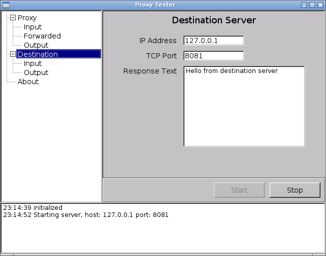
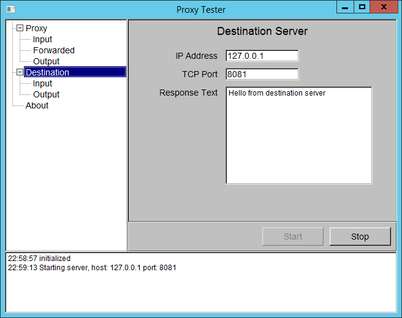

Proxy Testing Utility
=====================

Small GUI application for testing HTTP [Proxy Auto Config](https://en.wikipedia.org/wiki/Proxy_auto-config)
in various configurations.

 

How to build
------------

[stack](https://docs.haskellstack.org/en/stable/README/) tool is required for building.

Initial setup on Windows: [details](http://hackage.haskell.org/package/fltkhs-0.5.4.5/docs/Graphics-UI-FLTK-LowLevel-FLTKHS.html#g:8).

Build and run on Linux or Windows:

    stack install --flag fltkhs:bundled
    stack exec proxy-tester-exe

License information
-------------------

This project is released under the [Apache License 2.0](http://www.apache.org/licenses/LICENSE-2.0).
